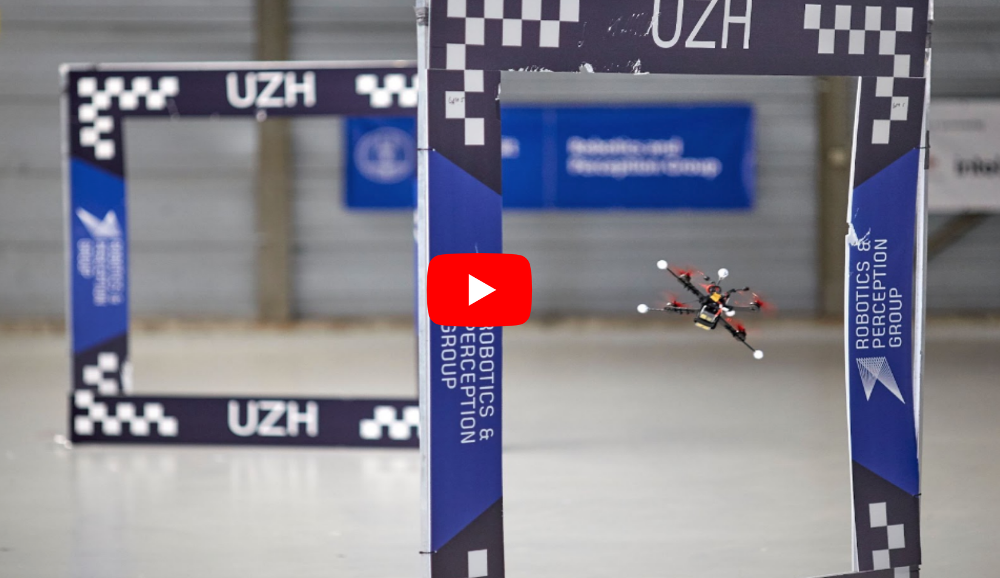

# Learned Inertial Model Odometry

[](https://youtu.be/2z2Slyt0WlE)

## Publication
If you use this code in an academic context, please cite the following [RA-L 2023 paper](http://rpg.ifi.uzh.ch/docs/RAL2023_Cioffi.pdf).

G. Cioffi, L. Bauersfeld, E. Kaufmann, and D. Scaramuzza,
"**Learned Inertial Odometry for Autonomous Drone Racing**,"
IEEE Robotics and Automation Letters (RA-L). 2023.

```
@InProceedings{CioffiRal2023
  author = {Cioffi, Giovanni and Bauersfeld, Leonard and Kaufmann, Elia and Scaramuzza, Davide},
  title = {Learned Inertial Odometry for Autonomous Drone Racing},
  booktitle = {IEEE Robotics and Automation Letters (RA-L)},
  year = {2023}
}
```

## Installation

These instructions have been tested on Ubuntu 20.04 and Python 3.9.

Create a conda environment, named *imo*, containing all the dependencies for the project:

```conda create -n imo --file conda_environment.yaml```

You might need to install *pyquaternion* manually. To do so: 

```pip install pyquaternion```

## Prepare dataset

You need to convert your data in the specific .hdf5 format required by the network.

The script used to convert the data from the [Blackbird dataset](https://github.com/mit-aera/Blackbird-Dataset) is in 
```learning/data_management/prepare_datasets/blackbird.py```.

An sample output for one of the trajectories used from the Blackbird dataset is in the folder ```dataset```.

You can use this script as reference to convert your own dataset.

## Learning Component

Run network training with:

```python src/main_learning.py --root_dir=datasets --out_dir=results --dataset=Blackbird --mode=train --imu_freq=100 --sampling_freq=100 --window_time=0.5```

The file ```src/main_learning.py``` contains the hyperparameters.

Run network on the test sequences:

```python src/main_learning.py --root_dir=datasets --out_dir=results --dataset=Blackbird --mode=test --imu_freq=100 --sampling_freq=100 --window_time=0.5 --model_fn=net_blackbird.pt --show_plots```

The training logs can be visualized in tensorboard:

```tensorboard --logdir=results/Blackbird/logs```

We provide the network trained on the selected trajectories from the Blackbird dataset (see paper for details) in ```results/Blackbird/checkpoints/model_net/net_blackbird.py```.

## Learned Inertial Odometry

Run the EKF with learned model updates with:

```python src/main_filter.py --root_dir=datasets --out_dir=results --dataset=Blackbird --data_list=test.txt --checkpoint_fn=net_blackbird.pt --model_param_fn=model_net_parameters_net_blackbird.json```

Plot filter output: 

```python src/filter/python/plot_filter_output.py --dataset_dir=datasets --result_dir=results --dataset=Blackbird --seq=clover/yawForward/maxSpeed5p0/test```

For a more detailed evaluation of the filter performance use [this](https://github.com/uzh-rpg/rpg_trajectory_evaluation). 

## Credits

This repo uses some external open-source code:

* [TLIO](https://github.com/CathIAS/TLIO)
* [RPG trajectory evaluation toolbox](https://github.com/uzh-rpg/rpg_trajectory_evaluation)

Refer to each open-source code for the corresponding license.

If you note that we missed the information about the use of any other open-source code, please open an issue.
